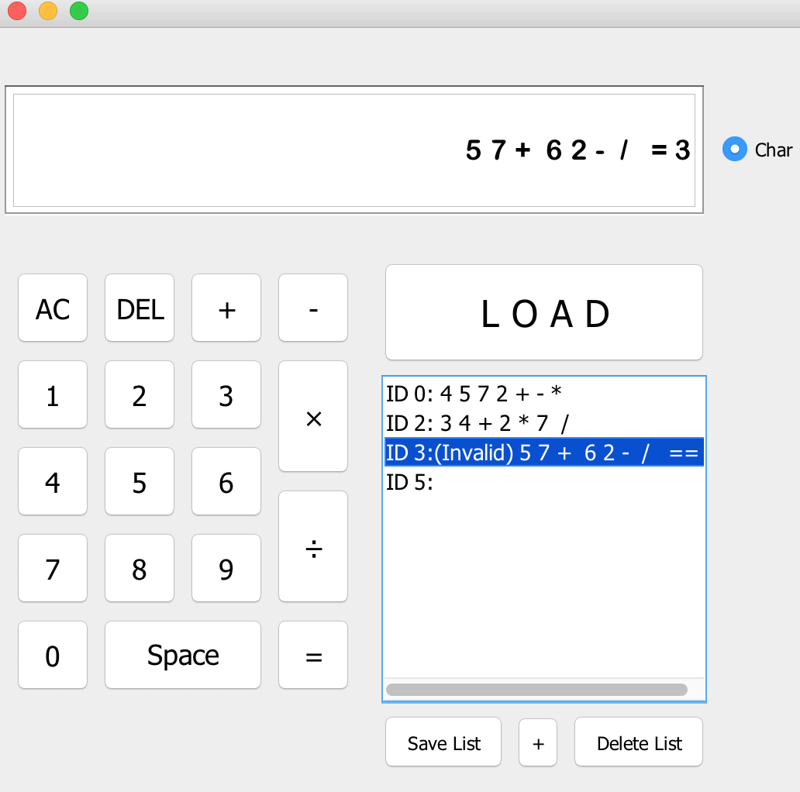

# Post-Fix-Evaluation
A program that can evaluate post-fix calculation. 
  *e.g.* 4 5 7 - +  evaluates to 6, since 4 - 5 = -1 and -1 + 7 = 6

## Tools used
- Framework: Java Swing, MVC.
- IDE: NetBeans
-  Abstract Data Type: Stack (actually main goals for this project is to fully understand stack's usage

 

## Notes
- Source code is in ./Project/src/PostFix/
- **RunPostFixCalculator.java** is where _main()_ is stored. To run the project, run this file.
- **Stack.java** is a simple implementation of Stack for Type _char_ and _int_
- **PostFixController.java** helps communicate between the core function and GUI
- **PostFixCalculatorGUI.form & .java** is the GUI component, created with the help of NetBeans 
- **Equation.java** is a class for each of the post-fix equation. It contains the core functions of this program.
- **CalculatorFilterForChar.java** and **CalculatorFilterForInt.java** are subclasses of _DocumentFilter_. They are used to filter all invalid inputs on the text field of the GUI.
  - When user turn on "Char" button located on the right of the text field, the CHAR filter is used, otherwise INT filter.

## Features
This app can evaluate both char and integer postfix operations. By cliking the "Char" button to enable the char feature. All the char will be evaluated by ASCII code. 
  It can check the validity of the postfix expressions entered
  It will store all the evaluated expressions on a local directory, it comes handy for user to go back to previous evaluations.
  The list on the left shows all the history, by cliking LOAD button when running will load all the previous evaluations.
   
Here's an image.

